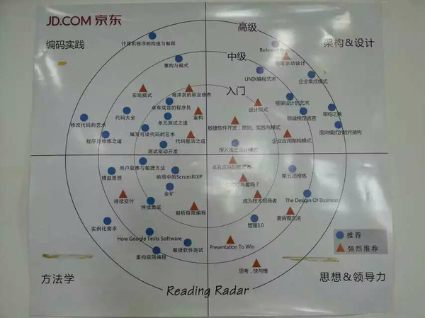
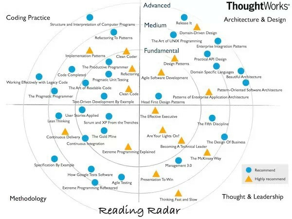

## 2015/6/17 study note

1. Bug learn: entitlement.  
2. CAB  
3. C# how to fire event?? the underlying details?  
4. [http://www.zhihu.com/question/20957940](http://www.zhihu.com/question/20957940)  
   为什么越来越多大学生沉溺于游戏中？  
5. [http://blog.jobbole.com/87562/](http://blog.jobbole.com/87562/)  
   Tmux：Linux 从业者必备利器
6. [http://www.zhihu.com/question/30226714](http://www.zhihu.com/question/30226714)  
   如何在编程路上走的更快，更有效率?  
     
     
7. [http://www.zhihu.com/question/23498424](http://www.zhihu.com/question/23498424)  
   你在 GitHub 上看到过的最有意思的项目是什么？ 
8. [http://www.codeproject.com/Articles/186192/Command-Design-Pattern](http://www.codeproject.com/Articles/186192/Command-Design-Pattern)  
   Command Design Pattern  
9. [https://www.gitbook.com](https://www.gitbook.com) 
10. [http://www.zhihu.com/question/30262900](http://www.zhihu.com/question/30262900)  
   有没有一段代码，让你觉得人类的智慧也可以璀璨无比？ 
11. Git 最简明的教程  
   [http://rogerdudler.github.io/git-guide/index.zh.html](http://rogerdudler.github.io/git-guide/index.zh.html)
12. GitHub 或者其他的开源平台中是否有一些适合初学者的 C++ 项目？
   [http://www.zhihu.com/question/28341521](http://www.zhihu.com/question/28341521)
13. [http://zh.lucida.me/blog/whiteboard-coding-demystified/](白板编程浅谈——Why, What, How)  
   白板编程浅谈——Why, What, How

   